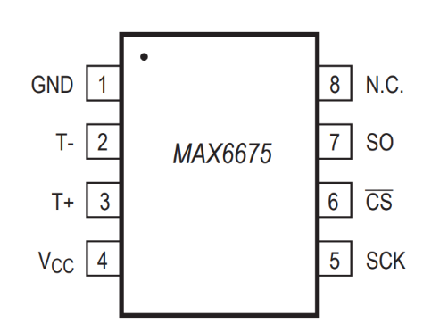
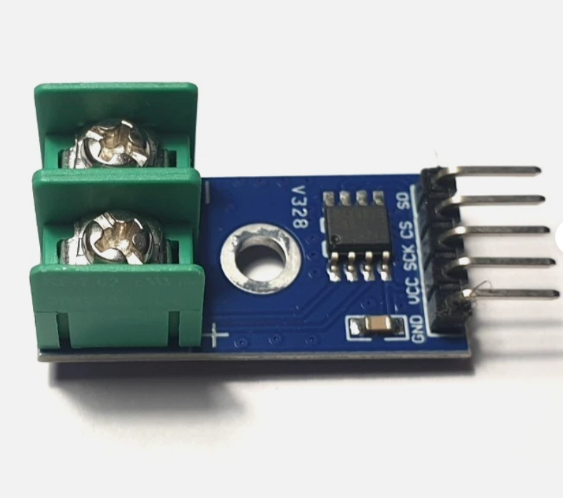
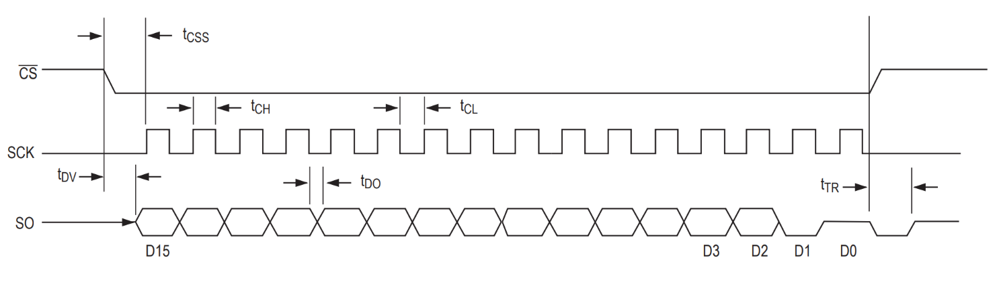
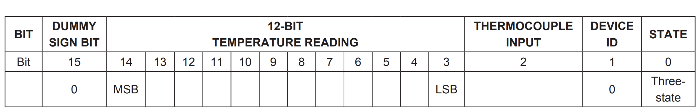
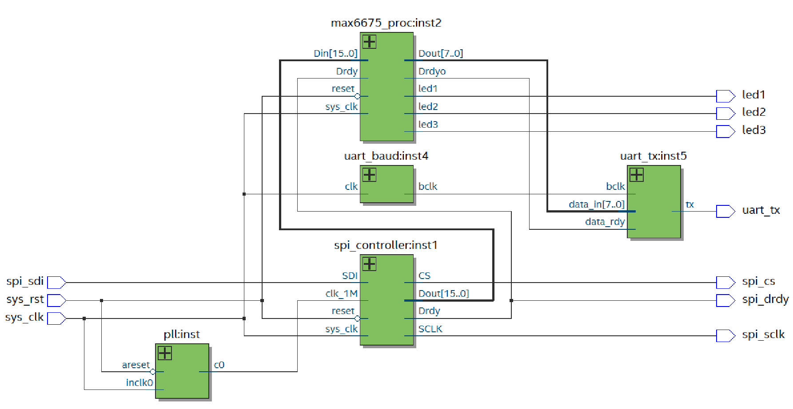
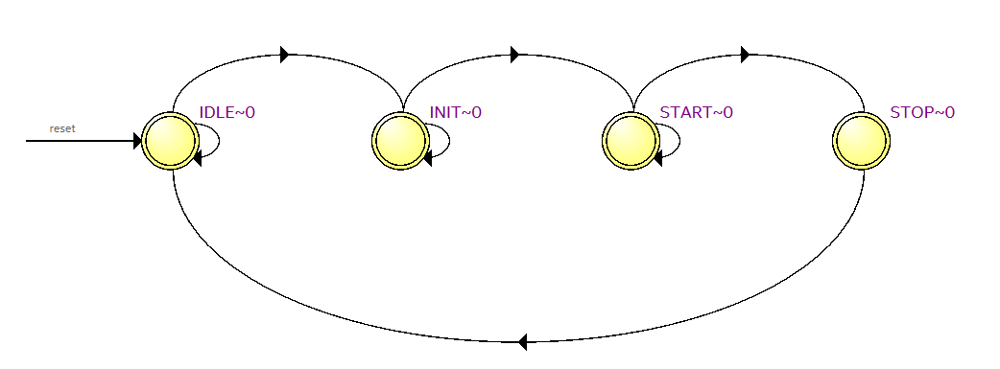
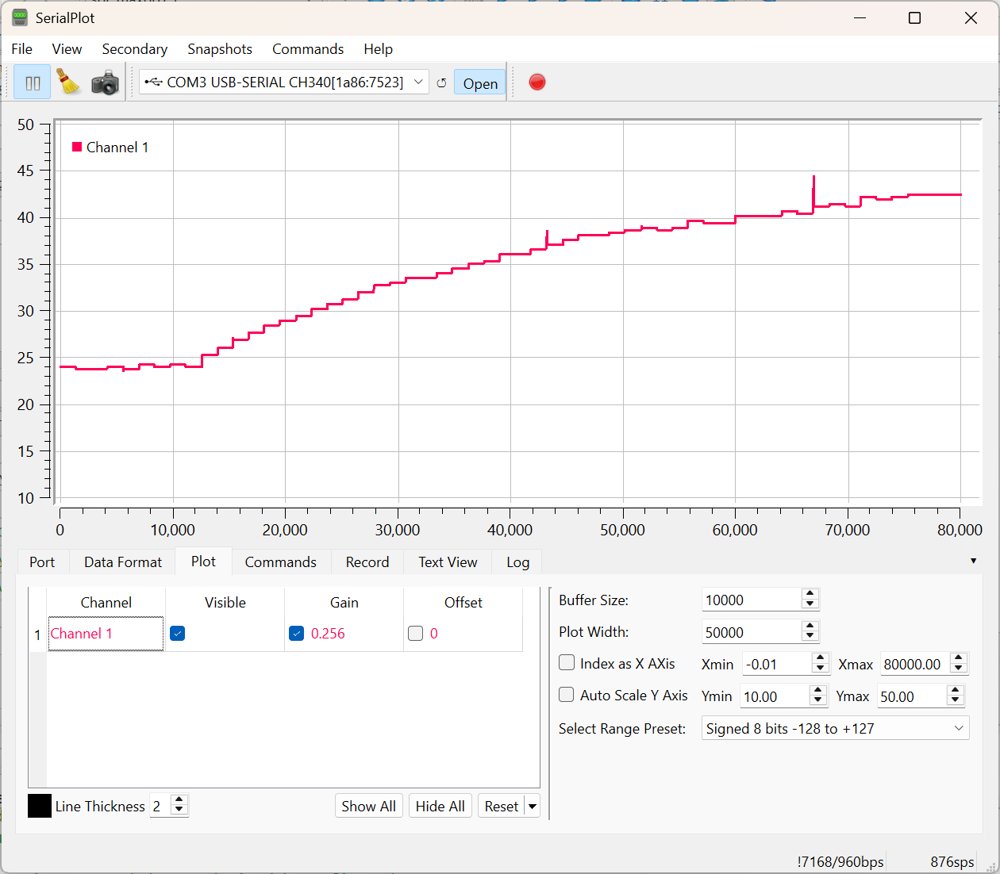

This project demonstrates SPI interface implementation to temperature sensor MAX6675. A breakout board of MAX6675 was used and wired to the Cyclone IV development board.

 

MAX6675 is a cold-junction compensated K-type thermocouple to digital converter. It digitizes the signal from a type-K thermocouple and outputs a 12-bit voltage (uV) over the SPI interface. The Serial Interface Protcol and the 16-bit sensor output is shown below.

A block diagram of the HDL implementation is shown below. A PLL is used to derive a 1MHz clock from the onboard 50MHz oscillator. This 1MHz clock is used to drive the SPI interface. The spi_controller block is responsible of the SPI protocol implementation which is done using a State Machine show below. It receives the serial data and converts it to a parallel data on its output. This is fed to the max6675_proc block which converts the uV voltage value into temperature. 

The resolution of MAX6675 is 10.25uV/LSB or 41uV/OC. That is 0.25OC/LSB or 250mC/LSB. Therefore, for ease of implementation, the 12-bit ADC output is multiplied by 250 to get a millidegree Celsius temperature reading. This is then divided by 256 to convert it to an 8-bit value that can be easily trasmitted over the UART interface to the PC. Refer to UART_PC for information about the UART implementation.
This for sure limits the readable range of MAX6675 to 0-65OC. However, this is sufficient for the purpose of this project which is focused on SPI interface implementation.

On the PC side, SerialPlot was used to plot the data recieved from the FPGA over UART, where the recieved 8-bit value is gained by 0.256 to get the temperature reading in degrees Celsius. The plot below shows temperature readings of the thermocouple as it is dipped into a glass of hot water.

