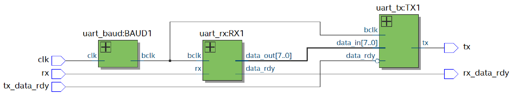

The top level of this design uart_top is made of three blocks, uart_baud, uart_tx and uart_rx. A schematic of the top level is shown below. The parallel data_out of the uart_rx block is connected to the parallel data_in of the uart_tx block so that the FPGA echos what it receives. The tx_data_rdy line is assigned to a push button on the development board such that the data is sent when the button is pressed.

Uart_baud is responsible of generating baud clock.it receives system clock as an input which is 50MHz in this implementation. It implements a counter to derive baud clock which is settable using the constant baud_rate. Baud Clock is 16 times the baud rate, so that each bit lasts 16 baud clock. When UART is receiving, the bit is sampled on the 8th baud clock.

Uart_rx is the receiver block. It receives baud clock form uart_baud and the serial data as inputs. It converts the serial data into parallel data which is output on data_out as 8bits. The implementation is based on a state machine which is shown below.

Uart_tx is the transmitter block. Similar to uart_rx, it receives baud clock and parallel data of 8bits as inputs. It converts parallel data into serial data which is output on tx. The implementation is based on a state machine which is shown below.

